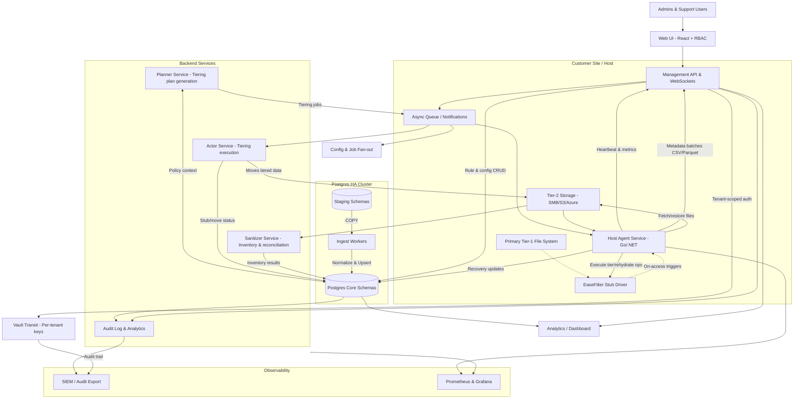
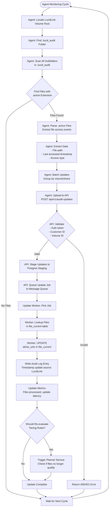

# Alto Tiered Storage Management – Workflow Diagram



---

## Filesystem Scan to Tiering Execution Flow

### Step-by-Step Process: Initial Full Scan CSV Processing

**Note**: This process is used for the **first-time scan** of a target. For LucidLink volumes, subsequent last accessed timestamp updates are handled via audit log monitoring (see LucidLink Audit Log Processing section below).

```mermaid
flowchart TD
    Start([Agent Scheduled Scan Triggered]) --> Scan[Agent: Scan Filesystem]
    Scan --> Generate[Agent: Generate CSV/Parquet<br/>File metadata batch]
    Generate --> Compress[Agent: Compress & Chunk<br/>if needed]
    Compress --> Upload[Agent: Upload to API<br/>POST /api/v1/scan-results]
    
    Upload --> Validate{API: Validate<br/>- Auth token<br/>- Customer ID<br/>- Host ID<br/>- File format}
    Validate -->|Invalid| Reject[Return 400/401 Error]
    Validate -->|Valid| Stage[API: Stage to<br/>Postgres Staging Schema]
    
    Stage --> Queue[API: Queue Ingest Job<br/>to Message Queue]
    Queue --> IngestPick[Ingest Worker: Pick Job]
    
    IngestPick --> BulkLoad[Ingest: COPY CSV to<br/>Staging Table]
    BulkLoad --> Normalize[Ingest: Normalize Data<br/>- Parse timestamps<br/>- Calculate sizes<br/>- Extract extensions<br/>- Generate hashes]
    
    Normalize --> Dedupe[Ingest: Deduplicate &<br/>Merge with Existing Inventory]
    Dedupe --> Upsert[Ingest: UPSERT to<br/>Core file_current table]
    
    Upsert --> UpdateMeta[Update Host Metadata<br/>- Last scan time<br/>- File count<br/>- Total size]
    UpdateMeta --> TriggerPlanner[Trigger Planner Service]
    
    TriggerPlanner --> LoadRules[Planner: Load Active Rules<br/>for Customer]
    LoadRules --> EvalFiles{Planner: Evaluate Each File<br/>Against Rules}
    
    EvalFiles -->|Matches Rule| AddToJob[Add to Tiering Job]
    EvalFiles -->|No Match| Skip[Skip File]
    
    AddToJob --> BuildJobs[Planner: Build Tiering Jobs<br/>Group by priority & storage]
    BuildJobs --> EstimateCost[Planner: Estimate<br/>- Space savings<br/>- Transfer time<br/>- Bandwidth usage]
    
    EstimateCost --> QueueTier[Queue Tiering Jobs<br/>to Message Queue]
    QueueTier --> ActorPick[Actor Service: Pick Job]
    
    ActorPick --> SendToAgent[Actor: Send Job to Agent<br/>via WebSocket/gRPC]
    SendToAgent --> AgentExec[Agent: Execute Tiering<br/>- Calculate hash<br/>- Compress optional<br/>- Upload to Tier-2]
    
    AgentExec --> Verify[Agent: Verify Upload<br/>Hash check]
    Verify -->|Success| CreateStub[Agent: Create Stub via<br/>EaseFilter Driver]
    Verify -->|Failure| Retry{Retry Count<br/>< Max?}
    
    Retry -->|Yes| AgentExec
    Retry -->|No| LogError[Log Error & Alert]
    
    CreateStub --> UpdateRegistry[Agent: Update<br/>Stub Registry in CoreDB]
    UpdateRegistry --> AuditLog[Write Audit Log Entry]
    AuditLog --> NotifyUI[Notify UI via WebSocket]
    NotifyUI --> UpdateMetrics[Update Metrics<br/>Prometheus/InfluxDB]
    
    UpdateMetrics --> Done([Scan Processing Complete])
    LogError --> Done
    Reject --> Done
    Skip --> EvalFiles
```



### Key Data Flow Details

#### 1. **CSV/Parquet Format** (Agent Output)
```csv
file_path,file_size,last_modified,last_accessed,file_extension,permissions,owner,hash
"C:\Data\docs\report.pdf",5242880,2025-01-15T10:30:00Z,2025-10-20T14:22:00Z,.pdf,rw-r--r--,DOMAIN\user1,sha256:abc123...
"C:\Data\images\photo.jpg",2097152,2024-11-01T08:15:00Z,2025-10-25T09:00:00Z,.jpg,rw-r--r--,DOMAIN\user2,sha256:def456...
```

#### 2. **Staging Schema** (Postgres)
- Table: `scan_staging.raw_scans`
- Temporary storage before normalization
- Partitioned by `customer_id` and `scan_date`
- Retention: 7 days

#### 3. **Core Inventory Schema** (Postgres)

**Hybrid Approach**: The system maintains both immutable scan snapshots and a mutable current state:

**A. Immutable Scan History** (`file` table)
- One record per file per scan (historical point-in-time snapshots)
- Used for compliance, audit trail, and historical analysis
- Columns: `file_id`, `tenant_id`, `scan_id`, `dir_id`, `name`, `size_bytes`, `atime_unix`, `mtime_unix`, `ctime_unix`, `frn`

**B. Current Operational State** (`file_current` table - used by planner)
- One record per unique file (mutable, updated by scans and LucidLink audit)
- Used for rule evaluation and tiering decisions
- Columns:
  - `file_current_id` (bigserial, primary key)
  - `tenant_id` (UUID, foreign key)
  - `share_name` (TEXT)
  - `dir_id` (bigint, foreign key to `dir`)
  - `name` (TEXT)
  - `full_path` (TEXT, indexed) - denormalized for quick lookup
  - `size_bytes` (BIGINT)
  - `atime_unix` (INTEGER) - last accessed time
  - `mtime_unix` (INTEGER) - last modified time
  - `ctime_unix` (INTEGER) - creation time
  - `file_hash` (TEXT)
  - `file_extension` (TEXT)
  - `last_accessed_source` (TEXT) - enum: 'initial_scan' or 'lucidlink_audit'
  - `atime_updated_utc` (TIMESTAMPTZ) - when last_accessed was updated
  - `first_seen_scan_id` (bigint, foreign key)
  - `last_seen_scan_id` (bigint, foreign key)
  - `last_scan_utc` (TIMESTAMPTZ)
  - `created_utc` (TIMESTAMPTZ)
  - `updated_utc` (TIMESTAMPTZ)

**C. Tiering State** (`tier_object` table)
- Operational state machine for stubbing/rehydration
- Now includes warming event tracking
- Columns include: `state`, `planned_utc`, `acted_utc`, `last_accessed_utc`, `access_count`, `file_current_id`

#### 4. **Rule Evaluation Logic**
For each file, the Planner evaluates in priority order:
1. **Path matching**: Glob/regex against `file_path`
2. **Age criteria**: Check `last_modified` and `last_accessed`
3. **Size criteria**: Check `file_size` against min/max thresholds
4. **Extension filtering**: Include/exclude lists
5. **Existing stub check**: Skip if already stubbed
6. **First match wins**: Stop evaluation on first matching rule

#### 5. **Tiering Job Structure**
```json
{
  "job_id": "uuid",
  "customer_id": "uuid",
  "host_id": "uuid",
  "rule_id": "uuid",
  "files": [
    {
      "file_path": "C:\\Data\\docs\\report.pdf",
      "file_size": 5242880,
      "file_hash": "sha256:abc123...",
      "tiered_destination": "\\\\fileserver\\customer-123-tiered\\2025\\10\\28\\"
    }
  ],
  "priority": 10,
  "estimated_space_saved": 5242880,
  "estimated_duration_seconds": 15,
  "created_at": "2025-10-28T00:05:00Z"
}
```

#### 6. **Error Handling & Retry**
- **Network failures**: Retry with exponential backoff (max 3 attempts)
- **File locked**: Skip and retry in next scan
- **Storage unavailable**: Alert admin, queue for later
- **Hash mismatch**: Abort operation, keep original file
- **All errors logged**: CoreDB audit log + centralized logging

#### 7. **Performance Considerations**
- **Batch processing**: Process files in batches of 1000
- **Parallel workers**: Multiple ingest workers for concurrent processing
- **Rate limiting**: Throttle tiering operations to avoid network saturation
- **Incremental scans**: Future optimization - only scan changed files
- **CSV compression**: Reduce network transfer (gzip/zstd)

#### 8. **Monitoring & Observability**
Metrics tracked at each stage:
- Scan duration and file count
- CSV upload size and transfer time
- Ingest processing time
- Rule evaluation performance
- Tiering success/failure rates
- Storage space saved
- Agent health and connectivity

---

## LucidLink Audit Log Processing Flow

### Overview

For LucidLink volumes, after the initial full scan, the system monitors audit logs to capture real-time last accessed timestamp updates without requiring full filesystem rescans.

### Step-by-Step Process: Audit Log Monitoring



### LucidLink Audit Log Details

#### 1. **Audit Log Structure**
- **Location**: `<LucidLink Volume Root>\.lucid_audit\`
- **Subfolders**: Multiple subfolders containing audit files
- **File Pattern**: Files with `.active` extension contain current/recent access events
- **Format**: Proprietary LucidLink format (requires custom parser)

#### 2. **Monitoring Strategy**
- **Polling Interval**: Configurable (default: every 5 minutes)
- **Incremental Processing**: Track last processed position/timestamp per file
- **Deduplication**: Ignore already-processed events using event IDs or timestamps
- **Error Handling**: Skip corrupted files, log errors, continue with next file

#### 3. **Update Batch Format** (Agent to API)
```json
{
  "update_batch_id": "uuid",
  "customer_id": "uuid",
  "volume_id": "uuid",
  "source_type": "lucidlink_audit",
  "collected_at": "2025-11-03T01:20:00Z",
  "updates": [
    {
      "file_path": "C:\\LucidVolume\\Data\\docs\\report.pdf",
      "last_accessed": "2025-11-02T18:45:23Z",
      "access_type": "read",
      "audit_file": ".lucid_audit\\subfolder\\audit_20251102.active"
    }
  ]
}
```

#### 4. **Database Update Logic**
```sql
-- Update last_accessed for matched files in file_current
UPDATE file_current fc
SET 
  atime_unix = s.new_last_accessed,
  last_accessed_source = 'lucidlink_audit',
  atime_updated_utc = now(),
  updated_utc = now()
FROM staging_lucid_audit s
WHERE 
  fc.tenant_id = s.tenant_id
  AND fc.full_path = s.file_path
  AND s.new_last_accessed > fc.atime_unix; -- Only update if newer

-- Update warming events for stubbed files
UPDATE tier_object t
SET 
  last_accessed_utc = to_timestamp(s.new_last_accessed),
  access_count = t.access_count + 1
FROM staging_lucid_audit s
WHERE 
  t.tenant_id = s.tenant_id
  AND t.full_path = s.file_path
  AND t.state IN ('PLANNED', 'STUBBED');
```

#### 5. **Re-evaluation Triggers**
After updating last accessed timestamps:
- **Check Eligibility**: If previously planned/stubbed files now have recent access
- **Update Tiering State**: Mark files as "warmed" if accessed within retention period
- **Rehydration Priority**: Automatically trigger rehydration for accessed stub files
- **Rule Re-evaluation**: Re-run planner for files that may no longer qualify for tiering

#### 6. **Performance Considerations**
- **Batch Size**: Process up to 10,000 updates per batch
- **Async Processing**: Update worker processes batches asynchronously
- **Index Optimization**: Ensure `file_path` is indexed for fast lookups
- **Rate Limiting**: Throttle audit log polling to avoid overwhelming LucidLink volumes
- **Monitoring**: Track audit log processing lag and update latency

#### 7. **Error Handling & Recovery**
- **Missing Files**: Log warning if audit log references unknown file paths
- **Parse Errors**: Skip malformed audit entries, continue processing
- **Network Issues**: Retry with exponential backoff
- **Audit Log Rotation**: Handle log file rollover/archival gracefully
- **Duplicate Detection**: Use audit event IDs to prevent duplicate updates

#### 8. **Integration with Existing Workflows**

**Initial Scan vs. Audit Log Updates**:
- **First Time**: Full CSV/Parquet scan captures complete inventory
- **Ongoing**: Audit log monitoring updates only `last_accessed` timestamps
- **Hybrid Mode**: Periodic full scans (monthly) + continuous audit log monitoring

**Tiering Rule Impact**:
- Rules based on `last_accessed` are automatically re-evaluated
- Files with updated access times may be excluded from tiering
- Already-stubbed files with recent access may trigger rehydration alerts

**Audit Trail**:
- All timestamp updates logged with source: `lucidlink_audit`
- Maintains full history of access pattern changes
- Enables compliance reporting and access analytics
